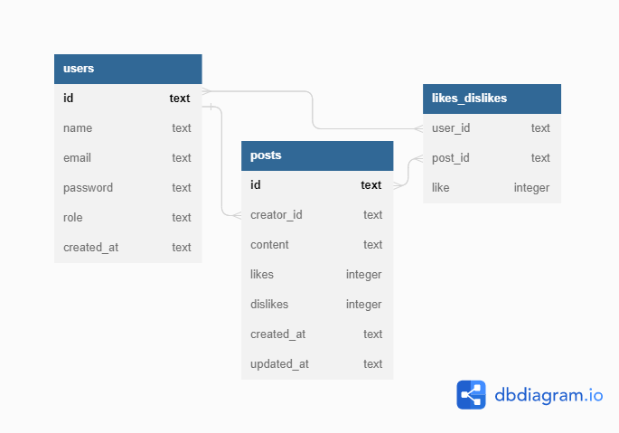

# Projeto Labook


O Labook é uma rede social com o objetivo de promover a conexão e interação entre pessoas. Quem se cadastrar no aplicativo poderá criar e curtir publicações.

## índice
- <a href="#funcionalidades-do-projeto">Funcionalidades do Projeto</a>
- <a href="#estruturação">Estruturação</a>
- <a href="#documentação">Documentação</a>
- <a href="#como-rodar-este-projeto">Como rodar este projeto?</a>
- <a href="#tecnologias-utilizadas">Tecnologias Utilizadas</a>
- <a href="#pessoas-autoras">Pessoas Autoras</a>
- <a href="#próximos-passos">Próximos Passos</a>

## Funcionalidades do Projeto

- [x] Cadastro de usuários
- [x] Login de usuário
- [x] Criação de posts
- [x] Visualização de todos os posts
- [x] Edição de posts
- [x] Exclusão de posts
- [x] Dar 'like' ou 'dislike' em um post

## Estruturação


## Documentação
Link para acessar a documentação:
[Deploy Labook](https://documenter.getpostman.com/view/25857659/2s93eYVCD1)

## Como rodar este projeto?

```bash
# Clone este repositório
$ git clone link-repo

# Acesse a pasta do projeto no seu terminal
$ cd nomeDaPasta

# Instale as dependencias
$ npm install

# Execute a aplicação
$ npm run dev

# A aplicação será iniciada na porta 3003, acesse pelo navegador: http://localhost:3003
```

## Tecnologias Utilizadas
1. [Typescript](https://www.typescriptlang.org/docs/)
2. [NodeJS](https://nodejs.org/en/docs)
3. [Express](https://expressjs.com/)
4. [SQL - SQLite](https://www.sqlite.org/docs.html)
5. [Knex](https://knexjs.org/)
6. [POO](https://developer.mozilla.org/en-US/docs/Learn/JavaScript/Objects/Object-oriented_programming)
7. Arquitetura em camadas
8. [UUID](https://developer.mozilla.org/en-US/docs/Glossary/UUID)
9. [Hashes](https://developer.mozilla.org/en-US/docs/Glossary/Hash)
10. Autenticação
11. Autorização
12. Roteamento
13. [Postman](https://learning.postman.com/docs/publishing-your-api/documenting-your-api/)

## Pessoas Autoras


[LinkedIN](https://www.linkedin.com/in/-lucas-tavares/)

Email: lucas.c.d.tavares@gmail.com

## Próximos Passos
- [] Deploy
- [] Testes unitários